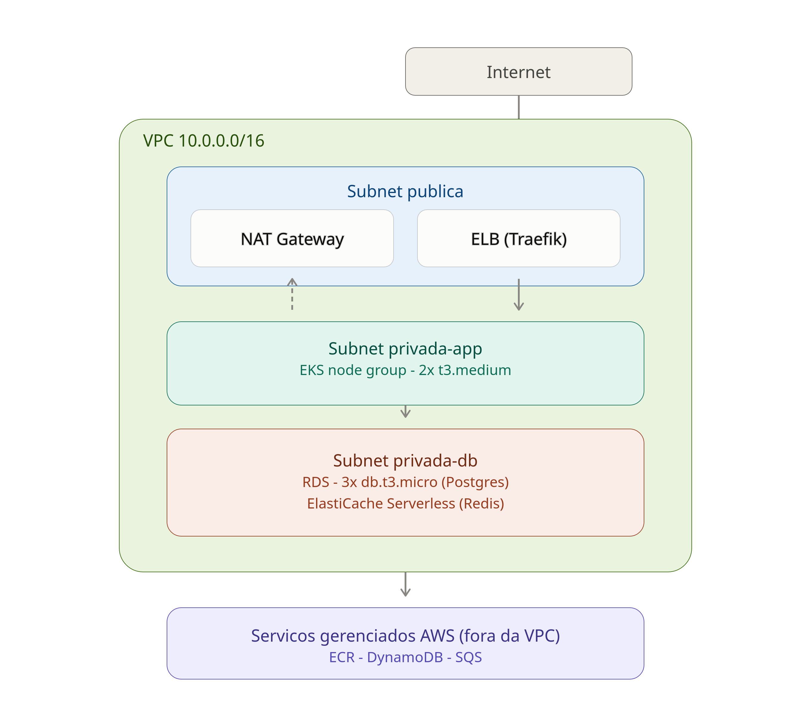

# TechChallange 2

## Arquitetura e principais desafios 

 - Internet/usuários — entrada externa, chega pela subnet pública.
 - Subnet pública — Tem a saída padrão (NAT Gateway) e a entrada padrão, ELB criado pelo service do traefik do tipo LoadBalancer
 - Subnet privada-app — onde ficam os nós do EKS (os 2 t3.medium). Eles saem para a internet (pull de imagem, chamadas de API) através do NAT da camada acima.
 - Subnet privada-db — totalmente isolada, sem rota de saída para internet. Vivem aqui as 3 instâncias RDS (auth, flag, targeting) e o ElastiCache Redis. Só o tráfego vindo da camada de app consegue chegar até eles.
 - Serviços gerenciados AWS
    - ECR (imagens Docker) 
    - DynamoDB (analytics) 
    - SQS (fila de evaluation) 
    - Esses serviços não estão dentro da uma VPC, são serviços da AWS acessados via API/endpoint, e o EKS se conecta a eles de fora.

### Limitações e dificuldades
 - Durante os primeiros testes no ambiente da AWS academy tivemos alguns problemas de criação de nodes no eks por conta que a academy bloqueia a criação de novas permissões, assim as máquinas eram criadas, mas não se conectavam ao cluster.
 - Outro ponto foi os $50 dolares sendo consumidos de forma bem rapida.
 - Uma dificuldade que sofremos foi a configuração do keda com autenticação IRSA no SQS, a instalação foi feita utilizando o helm, sem problemas, porém na criação da service accounts (keda-operator) o eksctl não teve sucesso nesse processo assim, gerando o erro: "the server has asked for the client to provide credentials". Foi necessario reinstalar o keda, e recriar a IAM Policy com permissão para consultar a fila do SQS.

## Explicação do porque utilizar Keda
 - Reproduzimos os ambientes tanta na AWS academy quanto na aws pessoal, durante os testes no ambiente limitado, utilizamos o hpa para validar as aplicações e funcionamento, o arquivo de configuração ainda se encontra disponivel na pasta do serviço.
 - Já dentro do ambiente pessoal, tinhamos a oportunidade de utilizar o KEDA, ferramenta com diversas possibilidades de integração, a escolha foi por simplismente querer conhecer uma nova ferramenta e aceitar o desafio proposto.

## Explique a diferença de propósito entre os 3 data stores utilizados
 - RDS, é um banco de dados relacional, onde a integridade e as relações entre os dados importam mais que a velicidade do trafego. 
 - ElastiCache, diferente do RDS rodando postgres aqui nosso foco é velocidade, assim utilizando o banco em memória, que tem a performance mais rapida que gravação em disco. Ele não é um banco de longo prazo pois guarda dados na RAM. Ele tem o proposito de reduzir consultas em bancos e entregar resposta em microssegundos.
 - DynamoDB, proprietario da AWS ele tem como objetivo a escala massica e latência previsível, ele é um banco NoSQL (chave-valor/documento), serverless que tem escala automatica gerenciada pela aws.
    Muito utilizado quando o padrão de acesso aos dadoas é previsivel, pois ele busca por chaves.

## Testar o evaluation-service 

Comandos para monitorar em outro terminal:
  - 'kubectl get hpa -A -w'
  - 'kubectl get pods -n evaluation-service -w'
  - 'kubectl get pods -n analytics-service -w'

curl -k "https://URL/evaluation/evaluate?user_id=user-123&flag_name=enable-new-dashboard"
curl -k "https://URL/evaluation/evaluate?user_id=user-abc&flag_name=enable-new-dashboard"

hey -z 10s -c 2 "http://URL/evaluate?user_id=user-123&flag_name=enable-new-dashboard"